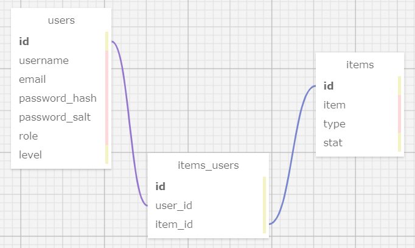

# _Kitchen Killerz_

### By _**Jo Miller & Mekinsie Callahan**_

#### _This project was created solely for the education of the author(s) and is not in a complete or portfolio-ready state. It should not be considered representative of professional work._

[Epicodus](https://www.epicodus.com/) - [Ruby and Rails](https://www.learnhowtoprogram.com/ruby-and-rails/) - [Week 4](https://www.learnhowtoprogram.com/ruby-and-rails/authentication-and-authorization/flickr-clone-rpg-two-day-project)

#### Date created: 03/23/2021
---

## Technologies Used

* _Ruby 2.6.5_
* _Rails 6.1.3_
* _Embedded Ruby (ERB)_
* _pg 1.2.3_
* _Webpacker 5.2.1_
* _jQuery Rails 4.4.0_
* _Rspec Rails 5.0.0_
* _Pry 0.14.0_
* _Byebug 11.1.3_
* _PostgreSQL 13.2_
* _Bundler 2.2.11_
* _Puma 5.2.2_
* _Launchy 2.5.0_
* _Faker 2.17.00_
* _Bootstrap-Sass 3.4.1_
* _git 2.30.0_
* _Devise_

---

## Description

Play an RPG game where you start off as a level 1 Chef and navigate through the kitchen world. Here, you can battle enemies and collect items as you progress through the game.

---

## User Stories

* As a user, I want to be able to create, edit, and delete my account.
* As a user, I want to be able to add, edit and delete my profile picture.
* As a user, I want to have an inventory of items that I can view, add, edit and delete.
* As a user, I want to visit locations to interact with items and enemies.
* As a user, I want to fight enemies to level up.
* As an admin, I want to be able to create, edit and delete locations.
* As an admin, I want to be able to create, edit, and delete items.
* As an admin, I want to be able to create, edit and delete enemies.
---
## Database Schema
The database for this application has the following tables and relationships:

---

## Requirements

* You will need to use your system's **terminal emulator** to setup and locally use this application.
* You must have **Ruby 2.6.5** installed to be able to launch this application ([how to install Ruby 2.6.5](https://www.learnhowtoprogram.com/ruby-and-rails/getting-started-with-ruby/installing-ruby)).
* **PostgreSQL** is required to manage this application's database. You can [follow this link](https://www.enterprisedb.com/downloads/postgresql) to install it.

---

## Setup/Installation

* To clone this directory, navigate in your terminal to the desired location of the project and run command `git clone https://github.com/joanna-miller/rpg.git`
* Navigate to top level of the directory with command `cd rpg`
* To install bundler for managing gems run command `gem install bundler`
* To install gems into the project run command `bundle install`
* Launch PostgreSQL to run a persistent database management server with command `postgres`
* To recreate database, run command `rake db:setup`
* To run tests using rspec, run command `rspec`
* To run a live server, from the root level of the project directory in your terminal, run command `rails server`
* To interact with application, navigate to http://localhost:3000/ in a web browser.
* Exit live server, press Ctrl+C in your terminal

--- 

## Editing Instructions

* To use Visual Studio Code to edit this project, follow install instructions [here](https://code.visualstudio.com/).
* To enable command `code`, open VS Code, click on View > Command Palette, type in "shell command", and click on "Shell Command: Install 'code' command in PATH"
* Now, from your terminal, in the project's top level directory, you can run command `code .` to open project in VS Code.

---

## Known Bugs

* No known bugs

---

## License

[MIT](LICENSE.txt)

---

## Contact Information

* _Contact Jo via [Email](mailto:joannadawnmiller@gmail.com) or [LinkedIn](https://www.linkedin.com/in/jomillerde/), or check out her [Github](https://github.com/joanna-miller)._
* _Contact Mekinsie via [Email](mailto:mekinsie.aja@gmail.com) or [LinkedIn](https://www.linkedin.com/in/mekinsie/), or check out her [Github](https://github.com/mekinsie)._
